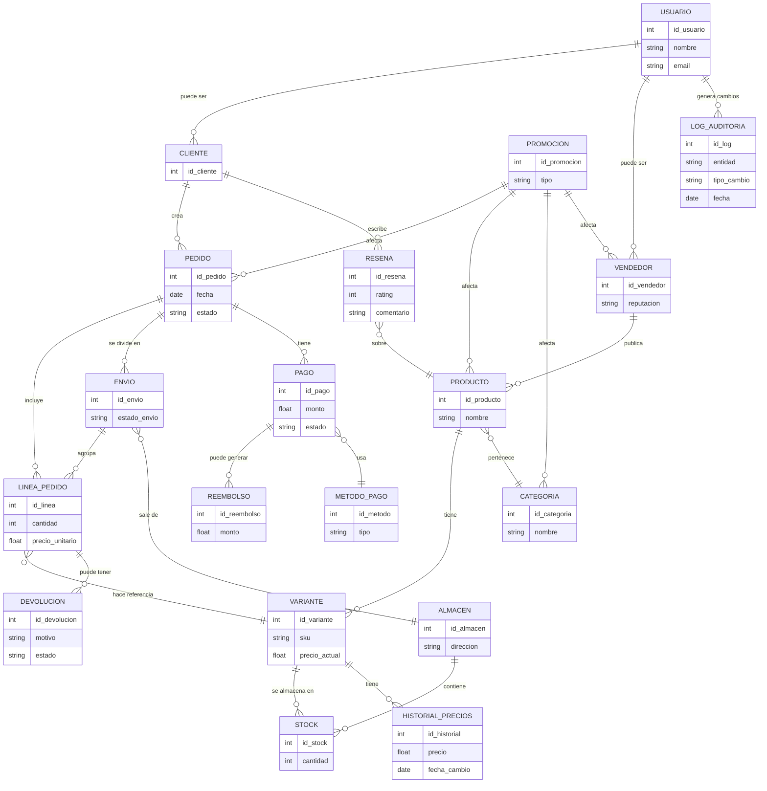

## Marketplace + Logística (ventas, proveedores, stock, envíos, devoluciones, promociones)

1. La plataforma es un **marketplace** donde **Vendedores** ponen a la venta **Productos** y **Clientes** compran.
2. Un **Usuario** puede ser ​**Cliente**​, **Vendedor** o ambos (modelo con subtipos).
3. Los **Productos** tienen **variantes** (p. ej. talla, color) y pertenecen a una **Categoría** jerárquica (categoría → subcategoría → …).
4. Cada **Producto/Variante** mantiene **inventario** por **Almacén** (multi-warehouse).
5. Los **Vendedores** pueden tener **múltiples almacenes** u ofrecer “dropshipping” (stock en proveedor).
6. Un **Pedido** es creado por un Cliente y puede contener múltiples **Líneas de pedido (order items)** (cada item apunta a una variante de producto).
7. Un **Pedido** puede dividirse en ​**varios envíos (Shipments)**​; un envío agrupa uno o varios items y tiene ​**estado de envío**​.
8. El sistema registra **Pagos** (posibles múltiples intentos, reembolsos parciales) y ​**Método de pago**​.
9. Existencia de ​**Devoluciones**​: se registra devolución por línea, motivo, estado y posible **nota de crédito** o reembolso.
10. **Promociones / Cupones** aplicables por producto, categoría, vendedor o pedido (fechas de validez, condiciones mínimas).
11. **Reseñas** y **Valoraciones** de producto por clientes, y ​**reputación de vendedor**​.
12. **Historial de precios** (price history) para cada variante — interesa para auditoría y análisis.
13. **Reglas de negocio** importantes: reserva de stock cuando se crea pedido; cancelación en ventana X minutos; bloqueo de envío si stock insuficiente; máximos de compra por cliente por producto (ej.: 5 unidades).
14. Registro de ​**logs de auditoría**​: quién creó/actualizó pedidos, cambios de stock críticos.
15. **Reportes** frecuentes: ventas por día/region/vendedor, productos sin stock, pedidos pendientes de pago.

## Paso 1 – Identificación de Entidades

- **Usuario** (superclase)
  - Cliente (subclase)
  - Vendedor (subclase)

- **Producto**
- **Variante de producto**
- **Categoría**

- **Almacén**
- **Stock**

- **Pedido**
- **Línea de pedido (OrderItem)**
- **Envío (Shipment)**
- **Devolución**

- **Pago**
- **Reembolso**
- **Método de pago**

- **Promoción / Cupón**

- **Reseña de producto**
- **Reputación de vendedor**

- **Historial de precios**

- **Log de auditoría**

---

## Paso 2 – Relaciones y Verbos

- **Usuario —< Tiene rol >— Cliente / Vendedor**
  - Un usuario puede ser cliente, vendedor o ambos.

- **Vendedor —< Publica >— Producto**
  - Un vendedor publica muchos productos (1:N).

- **Producto —< Tiene >— Variante**
  - Un producto tiene varias variantes (1:N).

- **Producto —< Pertenece a >— Categoría**
  - Una categoría agrupa muchos productos (1:N).
  - Categoría es jerárquica (categoría → subcategoría).

- **Variante —< Se almacena en >— Stock (por Almacén)**
  - Relación N:M entre variante y almacén.

- **Cliente —< Crea >— Pedido**
  - Un cliente puede crear muchos pedidos (1:N).

- **Pedido —< Incluye >— Línea de pedido**
  - Un pedido incluye varias líneas (1:N).
  - Cada línea referencia a una variante.

- **Pedido —< Se divide en >— Envío (Shipment)**
  - Un pedido puede tener múltiples envíos (1:N).

- **Envío —< Contiene >— Línea de pedido**
  - Un envío agrupa varios ítems (N:M).

- **Pedido —< Tiene >— Pago**
  - Un pedido puede tener varios intentos de pago (1:N).

- **Pago —< Puede generar >— Reembolso**
  - Un pago puede tener varios reembolsos parciales o uno total (1:N).

- **Pedido / Producto / Categoría / Vendedor —< Afectados por >— Promoción**
  - Promoción aplica a distintos niveles (N:M).

- **Cliente —< Escribe >— Reseña**
  - Una reseña pertenece a un producto (N:1).

- **Variante —< Tiene >— Historial de precios**
  - Cada variante guarda sus cambios de precio (1:N).

- **Sistema —< Registra >— Log de auditoría**
  - Cambios críticos de stock, pedidos y pagos (1:N).

---

## Paso 3 – Atributos (Nivel Conceptual)

### Usuario
- id_usuario, nombre, email, password, dirección  

### Cliente
- id_cliente (=id_usuario), historial_compras  

### Vendedor
- id_vendedor (=id_usuario), reputación, políticas_envío, datos_fiscales  

### Producto
- id_producto, nombre, descripción, categoría_id, vendedor_id  

### Variante
- id_variante, sku, atributos (talla, color…), precio_actual  

### Categoría
- id_categoria, nombre, id_padre  

### Almacén
- id_almacen, dirección, tipo (propio/dropshipping)  

### Stock
- id_stock, variante_id, almacen_id, cantidad  

### Pedido
- id_pedido, cliente_id, fecha, estado, total  

### Línea de pedido
- id_linea, pedido_id, variante_id, cantidad, precio_unitario  

### Envío (Shipment)
- id_envio, pedido_id, almacen_id, transportista, estado_envio  

### Devolución
- id_devolucion, linea_pedido_id, motivo, estado, resolución  

### Pago
- id_pago, pedido_id, metodo_pago_id, estado, fecha, monto  

### Método de pago
- id_metodo, tipo (tarjeta, PayPal, transferencia)  

### Reembolso
- id_reembolso, pago_id, monto, fecha  

### Promoción
- id_promocion, tipo, condiciones, fecha_inicio, fecha_fin, descuento  

### Reseña
- id_resena, cliente_id, producto_id, rating, comentario, fecha  

### Historial de precios
- id_historial, variante_id, precio, fecha_cambio, motivo  

### Log de auditoría
- id_log, usuario_id, entidad_afectada, tipo_cambio, fecha, detalle  

---

## Paso 4 – Identificadores

- Usuario: **id_usuario**
- Cliente: **id_cliente** (=id_usuario)
- Vendedor: **id_vendedor** (=id_usuario)
- Producto: **id_producto**
- Variante: **id_variante**
- Categoría: **id_categoria**
- Almacén: **id_almacen**
- Stock: **id_stock**
- Pedido: **id_pedido**
- Línea de pedido: **id_linea**
- Envío: **id_envio**
- Devolución: **id_devolucion**
- Pago: **id_pago**
- Reembolso: **id_reembolso**
- Método de pago: **id_metodo**
- Promoción: **id_promocion**
- Reseña: **id_resena**
- Historial de precios: **id_historial**
- Log: **id_log**

---

## Paso 5 – Jerarquías de Generalización

### Usuario
- Cliente
- Vendedor

Restricciones:
- **Cobertura:** Total (todo usuario es cliente, vendedor o ambos)  
- **Disyunción:** No disjunta (puede ser ambos simultáneamente)  

---

